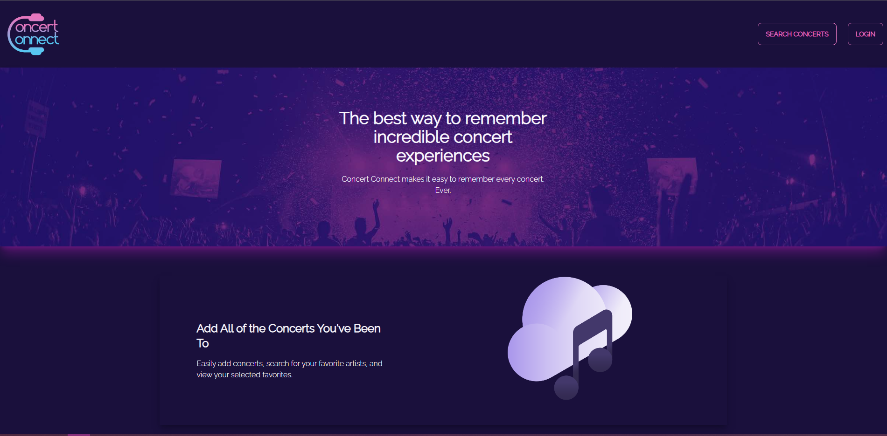
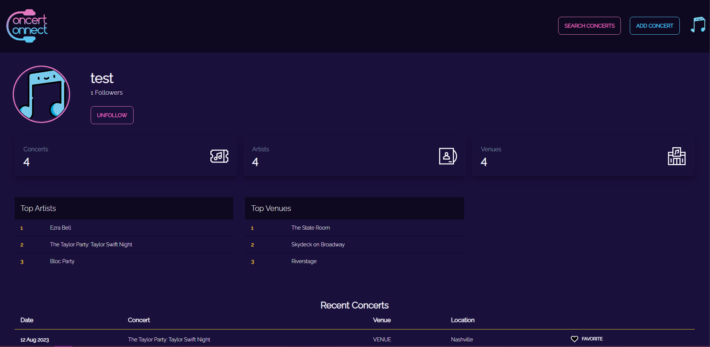

# Concert:Connect

  Concert:Connect allows concert-goers to log concerts they have attended to create an archive of all bands, venues, and locations they have seen. Users will be able to view their favorite bands’ pages, follow their friends and other concert-goers, or see reviews for venues ahead of time.  
  

  ## Description

  Users are able to use the application to view upcoming concerts, ratings & reviews, and information about artists and venues all without having to sign in. If users choose to create an account, they can begin saving concerts to their own personal history, as well as adding friends to follow, and saving a list of their favorite artists and venues. Users can use our search feature to help them find the exact event they want! Keeping up with your own personal musicians has never been easier than with Concert:Connect!

  Screenshot of landing page:  
  

  ## Table of Contents
  * [Dependencies](#dependencies)
  * [Installation](#installation)
  * [Executing Program](#executing-program)
  * [Authors](#authors)
  * [Questions](#questions)
  * [License](#license)
  * [Acknowledgements](#acknowledgements)
  * [Tests](#tests)

  Link to the repository:  
  https://github.com/Sabplpz/Concert-Connect.git

  ## Getting Started

  ### Dependencies
  Dependencies: axios, apollo, graphql, tailwindcss, apollo-server-express, bcrypt, express, jsonwebtoken, mongoose, @apollo/client, daisyui, jwt-decode, react, react-dom, react-router-dom, react-scripts.  
      
  Dev-Dependencies: nodemon, concurrently

  ### Installation
  No installation necessary! Just follow the steps below to execute (visit) the application page, and get started!

  ## Usage

  ### Executing Program
  Click the following link to visit the application page:  https://limitless-dawn-09471-5eef669ce044.herokuapp.com/ 
    
  Begin by clicking the "LOGIN" button on the top right corner of the landing page. If you don't already have an account, click "No account? Sign Up". Fill out the required information as for the form, as seen below:  
    
    
  Next, click on the "ADD CONCERT" button in the navigation bar to begin searching for upcoming concerts.  
    

  Type an artist or band into the search bar, and if they are touring, a dropdown list of their upcoming concerts will appear. Click on the concert you are planning on attending, then press "ADD CONCERT" to save it to your upcoming shows!  
    
    
  By clicking the user avatar in the top right corner, you can follow the links to your feed, your profile, or you can log out.  
    
  Your profile page will show you a summary of your upcoming concerts, your favorites, and lots of other info all about you!  
    

  On your feed page, you can leave reviews, or see reviews left by other users!  
    
    
  By clicking on the "SEARCH CONCERTS" button in the navigation bar, you can search an artist to see a list of all of their concerts at a quick glance. Use this page to also be redirected to the artists' Spotify page, or even buy tickets by follow the "BUY TICKETS" button  
  

  ## Additional Information

  ### Authors
  Robert Atwood, Dion Baskara, JJ Casseus, Sabrina Centeno, Mia Reid

  ### Contributing
  To help contribute to the project, reach out to us on Github.  
  There, you can report an issue if you encounter one.  
  GitHub profile: <a href="https://github.com/sabplpz">Click Here</a>

  ### License  
  MIT License: For more information,  <a href="https://opensource.org/license/mit/">click here</a>  
  See also: LICENSE.md file located within directory

  ### Acknowledgements
  Nickelback for being the hands-down greatest band of all time (Sorry Beatles/BTS/CCR/Tay/Bey)!
  